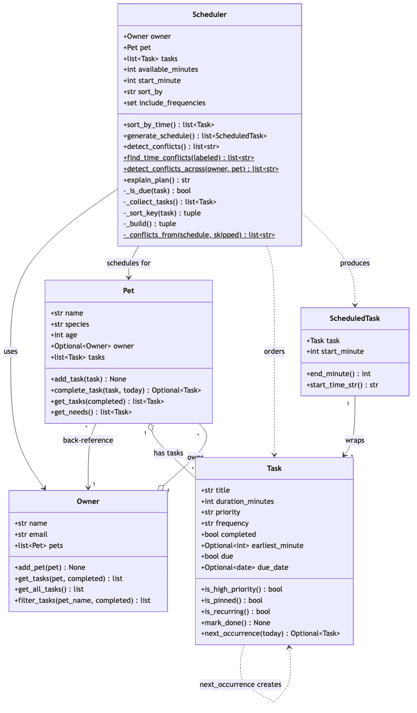

# PawPal+ (Module 2 Project)

You are building **PawPal+**, a Streamlit app that helps a pet owner plan care tasks for their pet.

## Scenario

A busy pet owner needs help staying consistent with pet care. They want an assistant that can:

- Track pet care tasks (walks, feeding, meds, enrichment, grooming, etc.)
- Consider constraints (time available, priority, owner preferences)
- Produce a daily plan and explain why it chose that plan

Your job is to design the system first (UML), then implement the logic in Python, then connect it to the Streamlit UI.

## What you will build

Your final app should:

- Let a user enter basic owner + pet info
- Let a user add/edit tasks (duration + priority at minimum)
- Generate a daily schedule/plan based on constraints and priorities
- Display the plan clearly (and ideally explain the reasoning)
- Include tests for the most important scheduling behaviors

## Features

The scheduling engine lives in `pawpal_system.py`. Each feature below names the algorithm and the method(s) that implement it.

- **Priority scheduling with a time budget** — tasks are placed high → medium → low, shortest-first on ties, and only while they fit inside the owner's available minutes; anything that overflows is skipped rather than dropped silently. (`Scheduler.generate_schedule()`, `Scheduler._build()`, `Scheduler._sort_key()`)
- **Sorting by time** — tasks can be ordered chronologically by their requested start time, with un-pinned tasks pushed to the end so a missing time never crashes the sort. (`Scheduler.sort_by_time()`, `sort_by="time"`)
- **Time-of-day pinning** — a task can request a fixed start time (`earliest_minute`); the builder honors it as the earliest the task may begin. (`Task.earliest_minute`, `Task.is_pinned()`)
- **Conflict warnings** — two independent checks: one reports tasks that were delayed past their pin or didn't fit the window; the other flags overlapping time windows within a single pet or across the whole household. Both return warning strings and never raise. (`Scheduler.detect_conflicts()`, `Scheduler.detect_conflicts_across()`, `Scheduler.find_time_conflicts()`)
- **Daily & weekly recurrence** — completing a recurring task automatically creates its next occurrence, advancing the due date by one interval using `timedelta` (so month/year rollovers are handled). One-off (`as_needed`) tasks do not repeat. (`Pet.complete_task()`, `Task.next_occurrence()`, `Task.is_recurring()`)
- **Filtering** — tasks can be filtered by pet name (case-insensitive) and/or completion status. (`Owner.filter_tasks()`, `Pet.get_tasks()`)
- **Multi-pet households** — one owner can register many pets, each with its own task list; the scheduler builds a separate plan per pet. (`Owner.add_pet()`, per-pet `Scheduler`)
- **Input validation** — invalid `priority` or `frequency` values are rejected at construction time, before they can corrupt the ordering logic. (`Task.__post_init__()`)
- **Human-readable plan** — a formatted daily plan with time slots, totals, skipped count, and conflict notes. (`Scheduler.explain_plan()`)

## Getting started

### Setup

```bash
python -m venv .venv
source .venv/bin/activate  # Windows: .venv\Scripts\activate
pip install -r requirements.txt
```

### Suggested workflow

1. Read the scenario carefully and identify requirements and edge cases.
2. Draft a UML diagram (classes, attributes, methods, relationships).
3. Convert UML into Python class stubs (no logic yet).
4. Implement scheduling logic in small increments.
5. Add tests to verify key behaviors.
6. Connect your logic to the Streamlit UI in `app.py`.
7. Refine UML so it matches what you actually built.

## Sample Output

Generated by running `python main.py` with owner Jordan, pets Mochi (dog) and Luna (cat),
and a mix of high / medium / low priority tasks. `main.py` also prints sorting, filtering,
auto-recurring, and conflict-detection demos; the daily plans (sorted by time, with conflicts) are shown below.

```
=======================================================
DAILY PLANS
-------------------------------------------------------
Daily plan for Mochi (dog)  —  owner: Jordan
Available time: 120 min  |  Starting at: 8:00 AM  |  Sorted by: time

  1. 8:00 AM  →  Give medicine (15 min, high priority)
  2. 8:15 AM  →  Morning walk (30 min, high priority)
  3. 8:45 AM  →  Play / fetch (20 min, medium priority)

Total: 65 min across 3 task(s).
Skipped: 1 task(s) that didn't fit in the available time.

Conflicts:
  'Morning walk' wanted 8:00 AM but starts at 8:15 AM (delayed 15 min).
  'Evening walk' (pinned to 6:00 PM, 30 min) doesn't fit in the available window.
-------------------------------------------------------
Daily plan for Luna (cat)  —  owner: Jordan
Available time: 120 min  |  Starting at: 8:00 AM  |  Sorted by: time

  1. 8:00 AM  →  Feeding (10 min, high priority)
  2. 8:10 AM  →  Nail trim (20 min, low priority)
  3. 8:30 AM  →  Brush fur (15 min, medium priority)

Total: 45 min across 3 task(s).
Skipped: 1 task(s) that didn't fit in the available time.

Conflicts:
  'Feeding' wanted 7:30 AM but starts at 8:00 AM (delayed 30 min).
  'Nail trim' wanted 8:00 AM but starts at 8:10 AM (delayed 10 min).
  'Litter box cleaning' (pinned to 10:00 AM, 10 min) doesn't fit in the available window.
=======================================================
```

## Testing PawPal+

Run the full test suite from the project root:

```bash
python -m pytest
```

### What the tests cover

The 22 tests in `test_pawpal.py` exercise every scheduling behavior and its edge cases:

- **Sorting correctness** — tasks are returned in chronological order; unpinned tasks sort last (no `None`-vs-`int` crash).
- **Recurrence logic** — completing a daily task creates one for the next day, weekly adds seven days, and `as_needed` tasks don't respawn; includes calendar rollover (Dec 31 → Jan 1).
- **Conflict detection** — overlapping and exact-duplicate time slots are flagged, within one pet and across pets; touching windows are not.
- **Schedule generation & time-budget fitting** — start times chain correctly, a task fits when its duration equals the remaining time, and an oversized task is skipped while a smaller one still fits.
- **Filtering** — by pet name (case-insensitive) and by completion status.
- **Validation** — invalid `priority` or `frequency` values raise `ValueError` at construction.

### Test run

```
$ python -m pytest
================================================================== test session starts ==================================================================
platform darwin -- Python 3.13.0, pytest-9.1.1, pluggy-1.6.0
rootdir: /Users/fatimahhassan/Documents/CodePath/AI_110/ai110-module2show-pawpal-starter
plugins: anyio-4.14.1
collected 22 items

test_pawpal.py ......................                                                                                                             [100%]

================================================================== 22 passed in 0.02s ===================================================================
```

### Confidence Level

**4 out of 5** — All 22 tests pass and cover every core behavior plus the highest-risk edge cases (empty pet, exact-time conflicts, calendar rollover, fit boundaries, validation). One point is held back because coverage is behavior-focused rather than exhaustive: the Streamlit UI in `app.py` has no automated tests, and some combinations (e.g. recurring tasks interacting with the daily fit/skip logic over many days) aren't yet stress-tested.

## System Design (UML)

Final class diagram, reflecting the implemented `pawpal_system.py` (source: [`diagrams/uml_final.mmd`](diagrams/uml_final.mmd)):



- **Owner** owns many **Pets**; each Pet keeps a back-reference to its Owner and holds a list of **Tasks**.
- **Scheduler** uses an Owner + Pet to produce **ScheduledTask**s (each wraps a Task with a start time).
- **Task** can spawn its own next occurrence (`next_occurrence()`), which drives the recurring-task logic.

## Smarter Scheduling

PawPal+ goes beyond a flat task list with four scheduling features. Each is implemented in `pawpal_system.py`:

| Feature | Method(s) | Notes |
|---------|-----------|-------|
| Task sorting | `Scheduler.sort_by_time()`, `Scheduler._sort_key()` | Chronological or priority order |
| Filtering | `Owner.filter_tasks()`, `Pet.get_tasks()` | By pet name and/or completion status |
| Conflict detection | `Scheduler.detect_conflicts_across()`, `Scheduler.find_time_conflicts()` | Overlapping time windows |
| Recurring tasks | `Task.next_occurrence()`, `Pet.complete_task()` | Auto-respawn daily / weekly |

### Sorting behavior

Tasks can be ordered by their pinned start time via **`Scheduler.sort_by_time()`**, which sorts on each task's `earliest_minute` (minutes from midnight) and pushes unpinned tasks to the end. The scheduler can also place tasks in priority order — a `sort_by="priority" | "time"` switch drives the ordering key in **`Scheduler._sort_key()`**, used by **`Scheduler._build()`** when laying out the day.

### Filtering behavior

**`Owner.filter_tasks(pet_name=None, completed=None)`** returns `(pet, task)` pairs filtered by pet name (case-insensitive) and/or completion status, so an owner can ask for "just Mochi's tasks" or "everything still pending." At the pet level, **`Pet.get_tasks(completed=...)`** filters one pet's tasks by status, and **`Pet.get_needs()`** is the pending-only shortcut the scheduler relies on.

### Conflict detection

**`Scheduler.detect_conflicts_across(owner, pet=None)`** flags pinned tasks whose time windows collide — within one pet or across the whole household (so "Mochi at 8:00" vs "Luna at 8:00" surfaces). It delegates the pairwise overlap check to **`Scheduler.find_time_conflicts()`**, a pure function that sorts by start time, compares `[start, end)` windows, and returns warning strings (never raises). Separately, **`Scheduler.detect_conflicts()`** reports tasks that were delayed past their requested time or dropped for not fitting the available window.

### Recurring task logic

When a repeating task is completed via **`Pet.complete_task(task)`**, the next occurrence is created automatically. **`Task.next_occurrence()`** computes the new `due_date` by adding one interval — `timedelta(days=1)` for daily, `timedelta(weeks=1)` for weekly (see the `FREQUENCY_DELTA` table) — and returns a fresh, uncompleted copy. One-off (`as_needed`) tasks return `None` and don't respawn. **`Task.is_recurring()`** is the guard that distinguishes the two.

## Demo Walkthrough

PawPal+ can be used two ways: an interactive Streamlit app (`streamlit run app.py`) and a scripted command-line demo (`python main.py`) that exercises every scheduler behavior end to end.

### Main UI features and actions

The Streamlit app (`app.py`) walks the user through four steps, each backed by the scheduling engine:

1. **Set owner** — enter a name to create the `Owner` that persists for the whole session.
2. **Add a pet** — register one or more pets (name + species); every pet gets its own task list.
3. **Add tasks** — for a chosen pet, enter a title, duration, and priority, choose how it repeats (daily / weekly / as_needed), and optionally pin it to a specific start time.
4. **Manage tasks** — mark any task complete (recurring tasks automatically respawn for the next day/week), and filter the task table by pet or by completion status.
5. **Generate a schedule** — pick a pet, set the available minutes, choose to order by time or priority, and view the resulting plan as a table with any conflict warnings shown beneath it.

### Example workflow

1. Set the owner to *Jordan*.
2. Add a pet: *Mochi*, a dog.
3. Add tasks for Mochi — a daily *Morning walk* (30 min, high) pinned to 8:00 AM, a daily *Feeding* (15 min, high), and a *Play / fetch* (20 min, medium).
4. Generate a schedule with 120 available minutes, ordered by time.
5. View today's plan: the walk is placed at 8:00 AM, the remaining tasks fill in after it, and any task that can't fit — or a second task pinned to the same time — appears as a warning.
6. Mark the *Morning walk* complete; PawPal+ automatically schedules the next day's walk.

### Key scheduler behaviors shown

- **Sorting** — with "order by time," tasks come out chronologically (pinned times first, un-pinned last); with "order by priority," high-priority tasks come first.
- **Time-budget fitting** — tasks are placed only while they fit the available minutes; overflow is reported as *skipped*.
- **Conflict warnings** — a task delayed past its pinned time, a task that doesn't fit, and two tasks booked at the same clock time (even across different pets) are each surfaced as a warning.
- **Recurrence** — completing a daily or weekly task creates the next occurrence with an advanced due date.
- **Filtering** — the task list can be narrowed to one pet or to only pending / only completed tasks.

### Sample CLI output

Running `python main.py` prints each behavior in its own labeled block:

```
=======================================================
SORTED BY TIME (Scheduler.sort_by_time)

Mochi:
       8:00 AM  →  Morning walk (30 min, high)
       6:00 PM  →  Evening walk (30 min, medium)
   unscheduled  →  Play / fetch (20 min, medium)

Luna:
       7:30 AM  →  Feeding (10 min, high)
      10:00 AM  →  Litter box cleaning (10 min, high)
   unscheduled  →  Brush fur (15 min, medium)

=======================================================
FILTER: only Mochi's tasks (Owner.filter_tasks)
  Mochi: [○] Evening walk (30 min, medium @ 6:00 PM)
  Mochi: [○] Morning walk (30 min, high @ 8:00 AM)
  Mochi: [✓] Feeding (15 min, high @ 12:00 PM)
  Mochi: [○] Play / fetch (20 min, medium)

=======================================================
AUTO-RECURRING (Pet.complete_task)
  Before: [○] Morning walk (30 min, high @ 8:00 AM, due 2026-07-05)
  Completed → [✓] Morning walk (30 min, high @ 8:00 AM, due 2026-07-05)
  Auto-created next occurrence → [○] Morning walk (30 min, high @ 8:00 AM, due 2026-07-06)

=======================================================
TIME CONFLICTS (Scheduler.detect_conflicts_across)
  Time conflict: 'Mochi: Morning walk' (8:00 AM–8:30 AM) overlaps 'Mochi: Give medicine' (8:00 AM–8:15 AM).
  Time conflict: 'Mochi: Morning walk' (8:00 AM–8:30 AM) overlaps 'Luna: Nail trim' (8:00 AM–8:20 AM).
  Time conflict: 'Mochi: Give medicine' (8:00 AM–8:15 AM) overlaps 'Luna: Nail trim' (8:00 AM–8:20 AM).

=======================================================
DAILY PLANS
-------------------------------------------------------
Daily plan for Mochi (dog)  —  owner: Jordan
Available time: 120 min  |  Starting at: 8:00 AM  |  Sorted by: time

  1. 8:00 AM  →  Give medicine (15 min, high priority)
  2. 8:15 AM  →  Morning walk (30 min, high priority)
  3. 8:45 AM  →  Play / fetch (20 min, medium priority)

Total: 65 min across 3 task(s).
Skipped: 1 task(s) that didn't fit in the available time.

Conflicts:
  'Morning walk' wanted 8:00 AM but starts at 8:15 AM (delayed 15 min).
  'Evening walk' (pinned to 6:00 PM, 30 min) doesn't fit in the available window.
=======================================================
```

Screenshots may be added below for human reviewers; the text walkthrough and CLI output above are the gradable demo.
